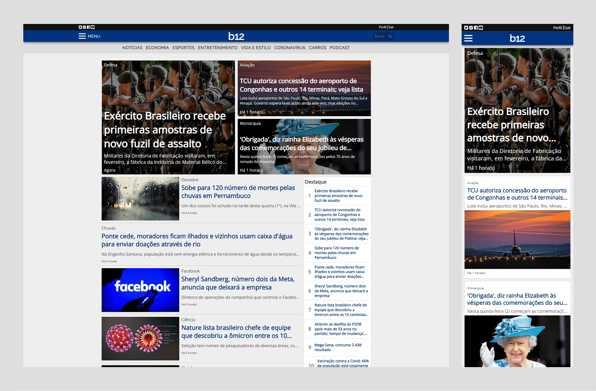

# b12 News (Front-end)

Back-end corresponding: https://github.com/GiovanniLeite/b12-news-back-end

## 📋 Presentation

Taking inspiration from popular news portals, this project is a comprehensive endeavor covering full-stack development. The front-end is crafted with Next.js and Typescript, while the back-end relies on Strapi (API) for content management, Cloudinary for image hosting, and PostgreSQL database managed through Docker. The website encompasses essential pages such as Home, News, Search, Category, Login, Registration, and Profile. Notable features include advanced search functionality by name or category, seamless pagination, reader comments, highlighted news sections, related articles, and exclusive access for registered users. The project received its last update in July 2023.

## 🛠️ Front-end built with
- TypeScript
- Next.js
- Redux Toolkit
- Redux Saga
- HTML5
- CSS3
- Styled Components
- Disqus
- ESLint
- Prettier

## 🔧 Installation

- Install dependencies: `npm install`

- Configure environment variables: `cp .env.example .env`

- Start development application: `npm run dev`

## 📫 Contact

